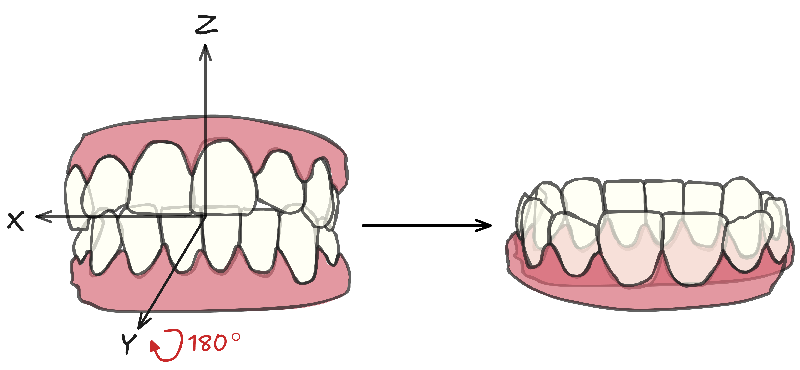

# ScanNormalizer

Minimal scan orientation normalizer.

Output orientation reference:



The repository keeps the user-facing single-scan entry point at the root:

```bash
python orient_scan.py /path/to/scan.stl --checkpoint runs/rotation/best.pt
```

Reusable Python code lives in `src/scannormalizer/`, auxiliary tools live in `scripts/`, and local data/results are expected under ignored `data/` and `runs/` folders.

Install dependencies:

```bash
pip install -r requirements.txt
pip install -e .
```

Download the pretrained checkpoint from Google Drive and place it at `runs/rotation/best.pt`:

https://drive.google.com/file/d/19SxZbUDqn9iS9_3H6uVtfjNOAFKGzWEX/view?usp=sharing

The training task uses the consistently oriented scans as the canonical frame:

1. Load mesh vertices.
2. Center them and scale to the unit sphere.
3. Sample a fixed number of points with farthest point sampling.
4. Apply either no rotation or a 180-degree rotation around X, Y, or Z.
5. Predict which of the four rotation classes was applied.
6. Train with cross entropy on the rotation class.

At inference time, the scan is PCA-aligned first, saved as a `_pca` mesh, then the model predicts which 180-degree correction to apply.

Train:

```bash
python scripts/train.py --data-root data/input --fold-dir data/splits/fold_1 --output-dir runs/rotation
```

To initialize from pretrained weights, pass a previous training checkpoint:

```bash
python scripts/train.py --data-root data/input --fold-dir data/splits/fold_1 --output-dir runs/rotation --checkpoint runs/rotation/previous/best.pt
```

Split files usually use one patient ID per line:

```text
023
104
```

An ID-only line selects every discovered STL for that patient whose filename contains `lower` or `upper`, case-insensitively. To select only one arch explicitly, use an `ID arch` tuple:

```text
023 lower
023 upper
```

The tuple matches an STL when both the identifier and arch occur in the scan path. Training recursively searches STL files under `--data-root`, which supports arbitrary folder structures such as one folder per patient.

Create split files:

```bash
python scripts/create_splits.py --data-root data/input --output-dir data/splits
```

Split generation also recursively searches `--data-root` and writes patient-level split entries.

Generate test ground-truth rotations:

```bash
python scripts/generate_eval_gt.py --input-dir data/input --gt-json data/gt/ground_truth.json --seed 42
```

GT generation recursively discovers STL files under `--input-dir`. To generate GT only for scans referenced by a fold, pass the same split folder used for training:

```bash
python scripts/generate_eval_gt.py --input-dir data/input --fold-dir data/splits/fold_1 --gt-json data/gt/ground_truth.json --seed 42
```

During training, the validation split from `fold_dir/val.txt` is used for validation loss after every epoch. A test run also runs before epoch 1 and after every epoch by default. The `--fold-dir` folder must contain `train.txt` and `val.txt`; `test.txt` is optional. Testing uses `fold_dir/test.txt` when present, otherwise it falls back to `fold_dir/val.txt`. It resolves those entries under `data/input/`, reads GT matrices from `data/gt/ground_truth.json`, and writes all predicted matrices to one `json/predictions.json` file inside each run directory. Disable testing with `--no-test`, or override paths with `--test-input-dir` and `--test-gt-json`.

Each training run creates a separate directory under `--output-dir` containing `last.pt`, `best.pt`, `args.json`, and the local Weights & Biases files. `args.json` records the command, parsed command line arguments, and resolved pretrained checkpoint path when `--checkpoint` is used. Training logs to the `ios_orientation` Weights & Biases project by default. Disable it with `--no-wandb`.

Orient one scan:

```bash
python orient_scan.py /path/to/scan.stl --checkpoint runs/rotation/best.pt --output-dir data/output
```

Add `--orient-only` to keep the output in the original scan scale instead of centering and scaling it to the unit sphere:

```bash
python orient_scan.py /path/to/scan.stl --checkpoint runs/rotation/best.pt --output-dir data/output --orient-only
```

For paired lower/upper scans in one patient folder, add `--preserve-occlusion`. The model is run only on the lower scan, then the same transform is applied to the sibling upper scan. Lower scans are detected by filenames containing `lower` or `mandibular`; upper scans are detected by filenames containing `upper` or `maxillary`, case-insensitively:

```bash
python orient_scan.py /path/to/patient --checkpoint runs/rotation/best.pt --output-dir data/output --preserve-occlusion
```

Orient a full input directory while preserving patient subfolders:

```bash
python scripts/batch_orient_scans.py --input-dir data/input --output-dir data/output --checkpoint runs/rotation/best.pt
```

For patient folders that contain paired lower/upper scans, preserve occlusion by inferring the transform from the lower scan only and applying it to both scans. Lower scans are detected by filenames containing `lower` or `mandibular`; upper scans are detected by filenames containing `upper` or `maxillary`, case-insensitively:

```bash
python scripts/batch_orient_scans.py --input-dir data/input --output-dir data/output --checkpoint runs/rotation/best.pt --preserve-occlusion
```

The batch script writes oriented STL files under the same relative paths in `data/output/` and saves quick visual QA sheets under `data/output/qa/`. By default each QA image contains up to 10 scans with X/Y/Z axes drawn in red/green/blue.

Regenerate only the QA plots from already oriented scans:

```bash
python scripts/batch_orient_scans.py --output-dir data/output --plot-only
```

The QA plots render points by default. If needed, increase the point size or switch to slower surface rendering:

```bash
python scripts/batch_orient_scans.py --output-dir data/output --plot-only --point-size 2.0
python scripts/batch_orient_scans.py --output-dir data/output --plot-only --render-mode surface --render-faces 20000
```

Use the inference API from Python:

```python
from scannormalizer.scan_inference import load_normalizer, normalize_scan

normalizer = load_normalizer("runs/rotation/best.pt", device="cuda", points=4096)
result = normalize_scan("data/input/patient/lower.stl", "data/output/patient/lower.stl", normalizer)
print(result.rotation_index)
```
